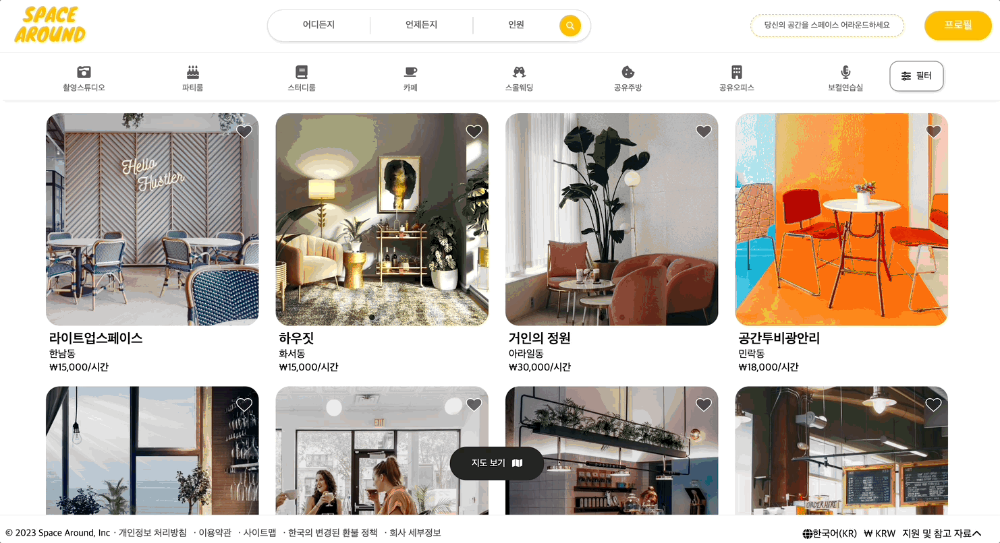
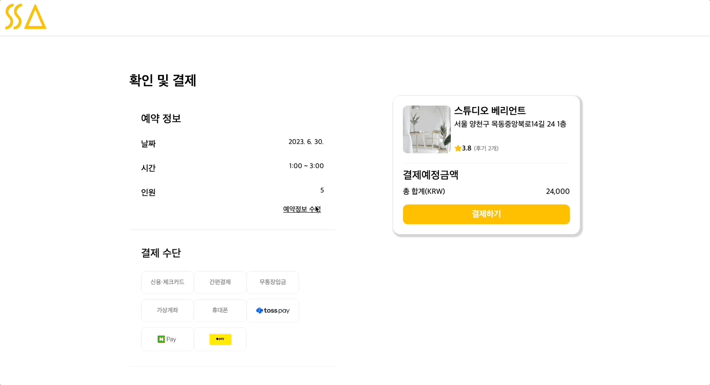
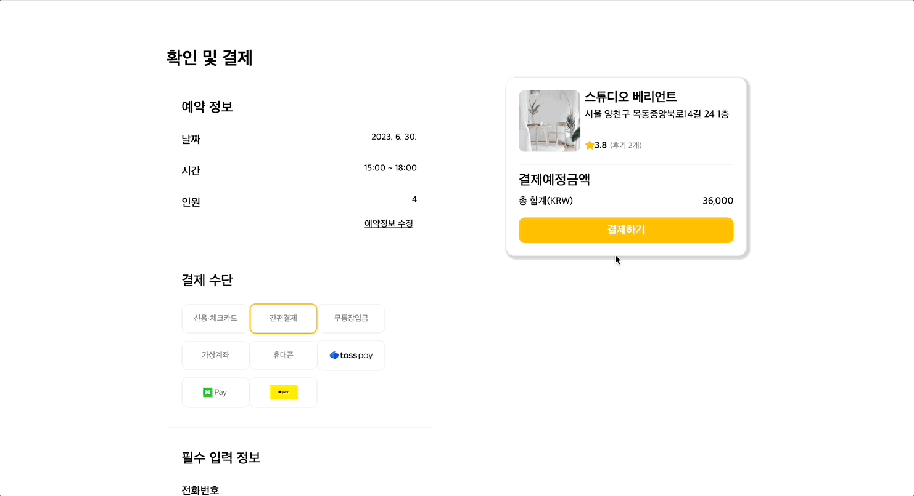

# 👨‍🚀 Space Around RESTful API

 

## 🤔 Introduction:

Space around RESTful API was created to meet the growing demand for space rental in a world where meetings are becoming more anonymous and non-face-to-face. We provide stylish spaces that appeal to the tastes of the MZ generation, who are known for their selfie profile culture. We aim to create a platform similar to Airbnb, where users can easily find and rent spaces that meet their needs. Our serivce is categorically divided into themes, making it easy for users to find the perfect space for their next event.

<table>
    <tr>
        <td></td>
        <td></td>
    </tr>
    <tr>
        <td></td>
        <td></td>
    </tr>
    <tr>
        <td></td>
        <td></td>
    </tr>
    <tr>
        <td></td>
        <td></td>
    </tr>
    <tr>
        <td></td>
        <td></td>
    </tr>
    <tr>
        <td></td>
    </tr>
  </table>
 

## 🥓 Description:

Our backend API is the central point for handling CRUD (Create, Read, Update, Delete) operations for our frontend application. The API's endpoints are primarily categorized into the following:

**User endpoints**: These endpoints allow users to perform CRUD operations on their own user accounts, such as creating a new account, logging in, and updating their profile information.

**Host Space endpoints**: These endpoints allow users to perform CRUD operations on hosted spaces, such as creating a new space, listing a space for rent, and updating a space's information.

**Reservation endpoints**: These endpoints allow users to perform CRUD operations on reservations, such as creating a new reservation, viewing a reservation, and canceling a reservation.
Space endpoints: These endpoints are used to display studios and details of each studio. They can also be used for filtering.

 

## 🥞 Tech:

For this project, I selected a technology stack of Node.js, Express, TypeORM, and MySQL. I am familiar with these technologies, and they offer simplicity and a large ecosystem of packages and libraries. Our marketplace site would heavily rely on real-time user interactions and event-driven processes, so Node.js was an ideal choice. Another advantage of this stack is its seamless handling of JSON data for communication with the frontend through the use of Express middleware. I tried to adhere to Node.js best practices and adopted a layered pattern to effectively organize our codebase and API structure during development.

 

## 🏃 How to run this API project:

**_To run this API, follow these steps:_**

1. Clone the project repository.
2. Run `npm install` to install the required npm packages.
3. Ensure that you have a local MySQL server running and import the provided SQL dump file.
4. Fill in the correct details in the `.env` sample.
5. Once you have completed the above steps, type `npm start` to start the server.

 

## 🧠 Learning points:

The biggest hurdle I faced was learning the importance of user flow. Not knowing the exact flow of our services made our work disorganized and we were unable to prioritize what needed to be built first. Another challenge I faced was understanding and using external APIs. It took me a long time to learn how to use APIs like Kakao Login, Toss Payments, and AWS S3 image uploading.

Other challenges I faced included writing SQL queries and realizing the importance of well-normalized databases for writing efficient queries. Overall, I learned a lot from this experience. I learned the importance of user flow, communication, and well-normalized SQL databases. I also realized that good communication in a team is essential for building a successful product.

 

## 👫 Team Members

### 💅 Front End

**[Front-End Team Github Project Link](https://github.com/wecode-bootcamp-korea/46-2nd-B1A4-frontend)**

- [Minji Kim](https://github.com/shfkd123)
- [Kaylla Son](https://github.com/kayllason)
- [GwonWoong Jang](https://github.com/5yoonl)

### 🎒 Back End

**[Back-End Team Github Project Link ](https://github.com/wecode-bootcamp-korea/46-2nd-B1A4-backend)**

- [Me](https://github.com/ts-oh)
